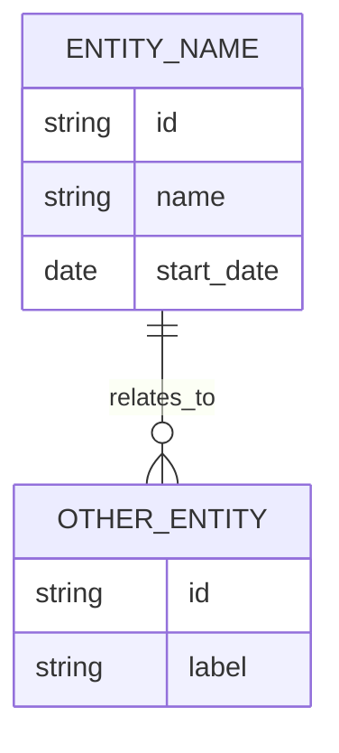

# SintOlogy

## Abstract
SintOlogy is a research repository for building a foundational OSINT ontology and a dynamic, ontology-driven workflow for data ingestion and visualization. The system is designed to adapt automatically as the ontology evolves, minimizing hard-coded assumptions.

## Objectives
- Define a reusable OSINT ontology based on a concise ERD source.
- Generate OWL2/RDF and a JSON schema from the ERD.
- Provide guided ingestion and a dynamic web viewer that follow the ontology.
- Enable AI-powered analysis and querying of OSINT data using client-side machine learning.

## Repository Structure
- ERD source: `erd/erd.md`
- Generated ontology (Turtle): `ontology/sintology.ttl`
- Generated ontology (JSON): `ontology/ontology.json`
- Ingestion CLI: `scripts/ingest.py`
- Ontology generator: `scripts/generate_ontology.py`
- Web UI: `web/` (served by `scripts/serve.py`)
- Graph store (local): `data/graph.json`

## ERD Format and Syntax
The ERD is defined in a Mermaid `erDiagram` block inside `erd/erd.md`. This is the source of truth for the ontology generator.

Minimal structure:


Rules:
- Entity names are uppercase with underscores, e.g., `SOCIAL_MEDIA_PROFILE`.
- Fields use `type name` with types: `string`, `date`, `datetime`.
- Foreign key columns ending with `_id` are ignored as datatype properties; relationships are expressed via edges.
- Relationship lines follow: `LEFT ||--o{ RIGHT : verb_phrase`.
- The generator converts names to PascalCase classes and camelCase properties.

## Usage

### 1) Generate ontology artifacts
```bash
python3 scripts/generate_ontology.py
# or, with uv:
uv run python scripts/generate_ontology.py
```

### 2) Ingest data (guided CLI)
```bash
python3 scripts/ingest.py
```

Batch load a JSON payload:
```bash
python3 scripts/ingest.py --load data/synthetic.json --non-interactive
```

### 3) Serve the web UI
```bash
# Using the provided serve script
python3 scripts/serve.py

# OR using Python's built-in HTTP server from project root
python3 -m http.server 8080
# Then open http://localhost:8080/web/
```

**Important**: The web server must be started from the project root directory so that the web app can access `/data/graph.json` and `/ontology/ontology.json`.

#### AI Features
The web UI includes AI-powered features using [Transformers.js](https://huggingface.co/docs/transformers.js):

**Question Answering** (Main page)
- Ask natural language questions about the graph data
- Uses BERT-based models for context-aware answers
- **Context is built from currently filtered/searched view** (both Graph and Table views)
- Filters, search, and focus node selection narrow down the data used for Q&A
- Context limited to 2000 characters with truncation warning if exceeded
- Example: "Who is Alex Parker?" or "What campaigns are there?"

**Text Analysis** (Separate page)
- Named Entity Recognition (NER) - Extract people, organizations, locations
- Relationship Extraction - Identify connections between entities
- Zero-Shot Classification - Classify text against ontology classes
- Toggle to detect new classes beyond existing ontology
- Export results in graph-compatible format for ingestion
- Ontology Mapping - Map entities to existing ontology structure

See [`web/README.md`](web/README.md) for detailed AI feature documentation.

## Data Format (Graph Store)
The local graph store is a JSON file with `nodes` and `edges`:
```json
{
  "nodes": [
    { "id": "node-id", "class": "Person", "properties": { "fullName": "..." } }
  ],
  "edges": [
    { "id": "edge-id", "type": "memberOfOrganisation", "from": "node-id", "to": "node-id" }
  ]
}
```

## Notes on Reproducibility
- Always regenerate the ontology after editing `erd/erd.md`.
- The ingestion and UI layers read the generated JSON schema, so they update automatically with ontology changes.
