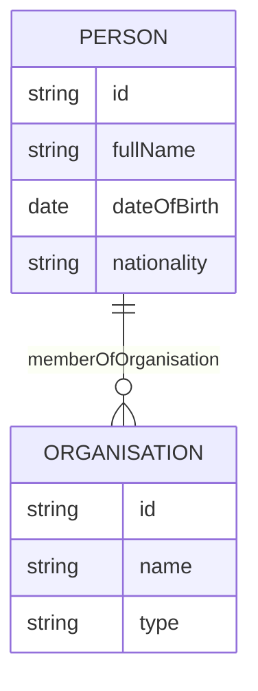

# SintOlogy: An Ontology-Driven OSINT Analysis Framework

**Author:** Ciaran McAleer  
**Repository:** https://github.com/CiaranMcAleer/SintOlogy  
**Date:** 2025

## Abstract

SintOlogy is a foundational framework for Open Source Intelligence (OSINT) analysis that addresses the challenge of data heterogeneity through formal ontology engineering. The system implements a dynamic, ontology-driven architecture that automatically adapts to schema evolution without requiring codebase modifications. By combining OWL2/RDF semantic modeling with client-side AI capabilities, SintOlogy provides a comprehensive platform for structured data ingestion, relationship visualization, and intelligent querying of OSINT datasets. The framework demonstrates how formal ontologies can serve as the central abstraction layer in intelligence analysis workflows, enabling reproducible research and extensible data models.

## 1. Introduction

### 1.1 Background

Open Source Intelligence (OSINT) analysis faces significant challenges regarding data standardization, relationship discovery, and knowledge representation. Traditional approaches rely on rigid database schemas that require software modifications when data models evolve. Furthermore, the proliferation of disparate data sources necessitates a flexible yet rigorous framework for integrating heterogeneous information.

### 1.2 Research Objectives

This work presents SintOlogy with the following objectives:

1. **Ontology Engineering:** Define a reusable, extensible OSINT ontology based on Entity-Relationship Diagram (ERD) formalism
2. **Schema Generation:** Automate the production of OWL2/RDF ontologies and JSON schemas from ERD specifications
3. **Dynamic Adaptation:** Develop ingestion and visualization components that automatically conform to ontology changes
4. **AI-Augmented Analysis:** Integrate client-side machine learning for natural language querying and entity extraction

### 1.3 Contributions

- A complete ontology-driven pipeline from ERD specification to interactive visualization
- Automated code generation that eliminates manual synchronization between ontology and implementation
- Client-side AI capabilities ensuring data privacy and offline functionality
- An extensible architecture supporting domain-specific OSINT ontologies

## 2. System Architecture

### 2.1 Conceptual Overview

SintOlogy implements a three-tier architecture:

```
┌─────────────────┐     ┌──────────────────┐     ┌─────────────────┐
│   Ontology      │────▶│   Schema         │────▶│   Application   │
│   Specification │     │   Generation     │     │   Layer         │
│   (ERD)         │     │   (OWL2/JSON)    │     │   (Dynamic)     │
└─────────────────┘     └──────────────────┘     └─────────────────┘
```

The ERD serves as the single source of truth. Changes to the ERD automatically propagate through generated schemas to the application layer without code modifications.

### 2.2 Ontology Specification

The ontology is defined using Mermaid ERD syntax in `erd/erd.md`:



**Syntactic Rules:**
- Entity identifiers: UPPERCASE_WITH_UNDERSCORES
- Property declarations: `type name` format
- Supported types: `string`, `date`, `datetime`
- Relationship notation: `ENTITY_A ||--o{ ENTITY_B : relationshipName`
- Foreign key columns (suffixed with `_id`) are excluded from datatype properties

### 2.3 Schema Generation Pipeline

The generation process transforms ERD specifications into multiple representations:

1. **OWL2/RDF (Turtle):** `ontology/sintology.ttl`
   - Formal semantic representation
   - Compatible with reasoners and semantic web tools

2. **JSON Schema:** `ontology/ontology.json`
   - Runtime consumption by application layer
   - Class definitions with properties and relationships

The generator performs the following transformations:
- Entity names → PascalCase class names
- Field names → camelCase property names
- Relationships → object properties with domain/range constraints

## 3. Implementation

### 3.1 Data Ingestion

The ingestion system provides a guided CLI for structured data entry:

```python
# scripts/ingest.py
# Interactive mode with ontology validation
python3 scripts/ingest.py

# Batch processing
python3 scripts/ingest.py --load data/synthetic.json --non-interactive
```

All ingested data is validated against the generated JSON schema, ensuring consistency with the ontology.

### 3.2 Graph Store

The local data store uses a simple JSON graph format:

```json
{
  "nodes": [
    {
      "id": "p_001",
      "class": "Person",
      "properties": {
        "fullName": "Alex Parker",
        "dateOfBirth": "1985-03-15"
      }
    }
  ],
  "edges": [
    {
      "id": "e_001",
      "type": "memberOfOrganisation",
      "from": "p_001",
      "to": "org_001"
    }
  ]
}
```

### 3.3 Web Interface

The visualization layer (`web/`) provides:

- **Graph View:** Interactive force-directed graph with filtering and search
- **Table View:** Tabular data presentation with sorting
- **AI Q&A:** Natural language querying of current dataset view
- **Text Analysis:** Named entity recognition and relationship extraction

**Serving the Application:**

```bash
python3 scripts/serve.py
# or
python3 -m http.server 8080
```

*Note: Server must run from project root for proper static file resolution.*

## 4. AI-Augmented Analysis

### 4.1 Architecture

AI capabilities are implemented using [Transformers.js](https://huggingface.co/docs/transformers.js), enabling client-side inference without data transmission:

```
┌──────────────┐     ┌──────────────┐     ┌──────────────┐
│   Web Worker │     │   Transformers│     │   ONNX Runtime│
│   Thread     │────▶│   .js         │────▶│   (WASM/GPU)  │
└──────────────┘     └──────────────┘     └──────────────┘
```

Web Workers prevent UI blocking during model inference.

### 4.2 Question Answering

The Q&A system uses:

- **Model:** SmolLM2-135M-Instruct (generative, via Transformers.js v3.1.2)
- **Context:** Dynamic construction from filtered graph view
- **Privacy:** All processing occurs client-side

**Usage:**
1. Apply filters/search to narrow the dataset
2. Enter natural language query (e.g., "Who is Alex Parker?")
3. Context is automatically built from visible nodes, therefore you can use search and other filters to limit context and improve accuracy of queries.
4. Model generates answer based on structured graph context

### 4.3 Text Analysis Pipeline

Comprehensive NLP capabilities for unstructured text:

**Named Entity Recognition:**
- Model: BERT-base-NER
- Entities: Person (PER), Organization (ORG), Location (LOC), Miscellaneous (MISC)
- Post-processing: Fragment merging for multi-word entities

**Relationship Extraction:**
- Zero-shot classification using ontology relationship types
- Confidence scoring for extracted relationships

**Ontology Mapping:**
- Fuzzy matching between extracted entities and ontology classes
- Dynamic mapping without hardcoded class names

**Export:**
- Graph-compatible JSON format for direct ingestion
- Preserves confidence scores and provenance metadata

## 5. Ontology Evolution

### 5.1 Modification Workflow

To evolve the ontology:

1. Edit `erd/erd.md` to modify entities, properties, or relationships
2. Regenerate artifacts:
   ```bash
   python3 scripts/generate_ontology.py
   ```
3. Application automatically uses new schema (no code changes required)

### 5.2 Reproducibility

The system ensures reproducibility through:
- Version-controlled ERD source
- Deterministic schema generation
- Validated ingestion against current schema
- Automatic UI adaptation to schema changes

## 6. Repository Structure

```
SintOlogy/
├── erd/
│   └── erd.md              # Ontology specification (source of truth)
├── ontology/
│   ├── sintology.ttl       # OWL2/RDF representation
│   └── ontology.json       # Runtime JSON schema
├── scripts/
│   ├── generate_ontology.py # ERD → Schema generator
│   ├── ingest.py           # Data ingestion CLI
│   └── serve.py            # Development server
├── web/
│   ├── index.html          # Main visualization interface
│   ├── text-analysis.html  # NLP analysis interface
│   ├── app.js              # Application logic
│   ├── text-analysis.js    # NLP pipeline
│   ├── qa-worker.js        # Q&A Web Worker
│   ├── text-analysis-worker.js # NLP Web Worker
│   └── styles.css          # Styling
├── data/
│   └── graph.json          # Local graph store
└── README.md               # This document
```

## 7. Dependencies & Acknowledgments

### 7.1 Core Requirements
- Python 3.9+
- Modern web browser (Chrome 90+, Firefox 89+, Safari 15+)

### 7.2 JavaScript Libraries

**AI/ML Runtime:**
- **[Transformers.js](https://github.com/xenova/transformers.js)** v3.1.2 — Client-side machine learning inference
  - ONNX Runtime for WebAssembly/WebGPU execution
  - Developed by Xenova (Joshua Lochner)

**Web Platform APIs:**
- Web Workers — Background thread execution for AI inference
- WebGPU — Hardware acceleration for model inference (Chrome/Edge 113+)
- Fetch API — Data retrieval
- Canvas API — Graph visualization rendering

**Visualization:**
- D3.js v7 — Force-directed graph layouts and interactive visualizations
- Native DOM APIs — Dynamic UI generation

### 7.3 Machine Learning Models

**Question Answering:**
- **SmolLM2-135M-Instruct** (HuggingFaceTB/SmolLM2-135M-Instruct)
  - Architecture: Small Language Model (SLM) based on Llama architecture
  - Parameters: 135M
  - Purpose: Generative question answering with ontology context
  - License: Apache 2.0

**Named Entity Recognition:**
- **BERT-base-NER** (Xenova/bert-base-NER)
  - Architecture: BERT (Bidirectional Encoder Representations from Transformers)
  - Parameters: 110M
  - Purpose: Extracting Person, Organization, Location, and Miscellaneous entities
  - Fine-tuned on CoNLL-2003 dataset

**Zero-Shot Classification:**
- **DistilBERT-base-uncased-mnli** (Xenova/distilbert-base-uncased-mnli)
  - Architecture: DistilBERT (distilled BERT)
  - Parameters: 66M
  - Purpose: Relationship extraction and ontology classification
  - Fine-tuned on Multi-Genre Natural Language Inference (MNLI)


**Browser Compatibility:**
- ✅ Chrome/Edge 113+ (WebGPU support)
- ✅ Chrome/Edge 90+ (CPU fallback)
- ✅ Firefox 89+ (CPU only)
- ✅ Safari 15+ (CPU only)
- ⚠️ Content blockers may interfere with CDN model downloads

## 8. Citation

If you use SintOlogy in your research, please cite:

```bibtex
@software{sintology2025,
  author = {McAleer, Ciaran},
  title = {SintOlogy: An Ontology-Driven OSINT Analysis Framework},
  year = {2025},
  url = {https://github.com/CiaranMcAleer/SintOlogy}
}
```

## 9. Acknowledgments

### 9.1 Libraries & Frameworks

This project builds upon the excellent work of numerous open-source communities:

**Machine Learning:**
- **[Transformers.js](https://github.com/xenova/transformers.js)** by Xenova (Joshua Lochner) — Making state-of-the-art ML models accessible in the browser
- **[ONNX Runtime](https://onnxruntime.ai/)** by Microsoft — Cross-platform ML inference
- **[Hugging Face](https://huggingface.co/)** — Model hosting and the Transformers ecosystem

**Visualization:**
- **[D3.js](https://d3js.org/)** by Mike Bostock and contributors — Data-driven documents
- **[Mermaid](https://mermaid.js.org/)** — Diagram generation from text

**Python Ecosystem:**
- **[RDFLib](https://github.com/RDFLib/rdflib)** — Python library for working with RDF
- **[Pandas](https://pandas.pydata.org/)** — Data analysis and manipulation
- **[Rich](https://github.com/Textualize/rich)** — Beautiful terminal output

**Semantic Web:**
- **[OWL2](https://www.w3.org/TR/owl2-overview/)** and **[RDF](https://www.w3.org/RDF/)** specifications by W3C
- **[Turtle](https://www.w3.org/TR/turtle/)** serialization format

### 9.2 Pre-trained Models

We gratefully acknowledge the model authors and organizations:

- **SmolLM2-135M-Instruct** by HuggingFaceTB (Hugging Face) — Efficient small language model
- **BERT-base-NER** by Davlan — Named entity recognition
- **DistilBERT** by Victor Sanh et al. (Hugging Face) — Distilled BERT for efficiency
- All models hosted on [Hugging Face Hub](https://huggingface.co/models)

### 9.3 Research & Inspiration

- Ontology engineering principles from **[OWL2](https://www.w3.org/TR/owl2-overview/)** and **[RDF](https://www.w3.org/RDF/)** specifications
- OSINT methodology from intelligence community best practices
- Client-side ML architecture inspired by **[Transformers.js](https://huggingface.co/docs/transformers.js)** examples

### 9.4 Community

- Contributors and testers who provided feedback
- The open-source intelligence (OSINT) community for domain expertise
- Academic advisors and peers who reviewed the ontology design

---

*This research software is provided as-is for academic and research purposes.*
