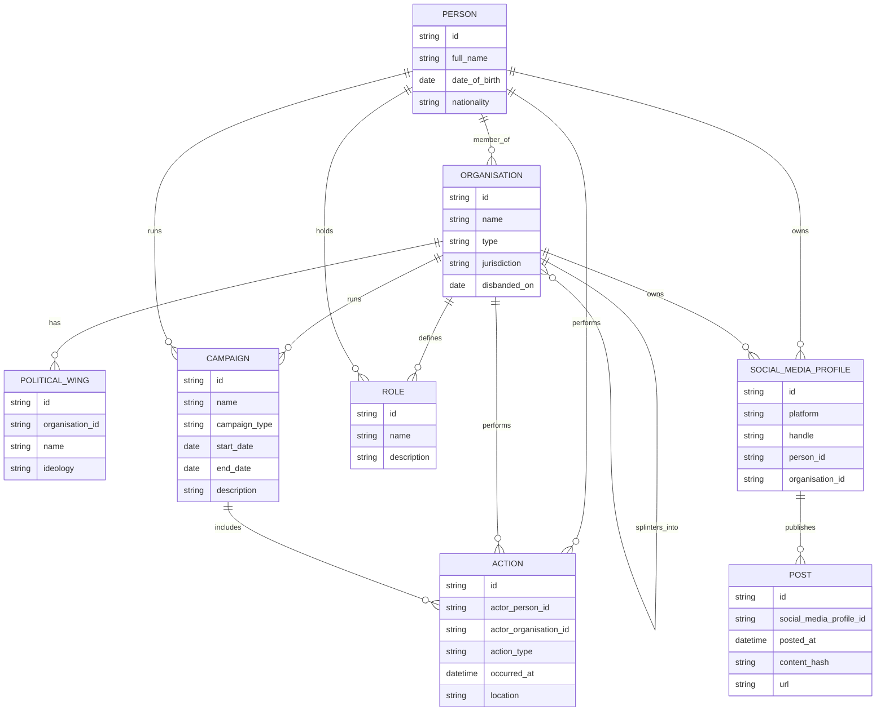

# ERD: OSINT Ontology (Initial Example)

Notes:
- Membership is modeled as a PERSON -> ORGANISATION relationship, so a person can belong to multiple organisations over time.
- ACTION can be attributed to a PERSON or directly to an ORGANISATION; set one of the actor_* fields.
- SOCIAL_MEDIA_PROFILE can belong to a PERSON or an ORGANISATION; set one of the owner fields.
- CAMPAIGN can be run by an ORGANISATION or PERSON.
- CAMPAIGN is composed of ACTION entries.
- ORGANISATION can splinter into one or more other organisations.
- ROLE is defined by an ORGANISATION and held by MEMBER within that organisation.
